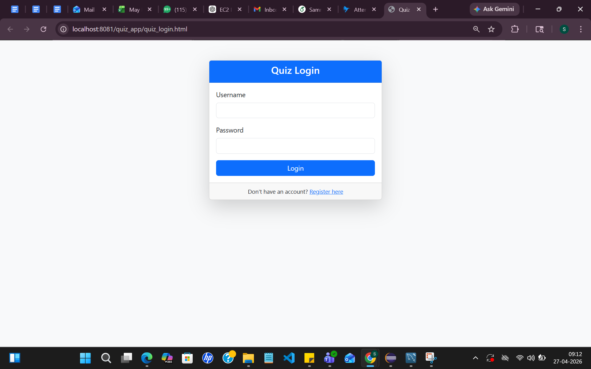
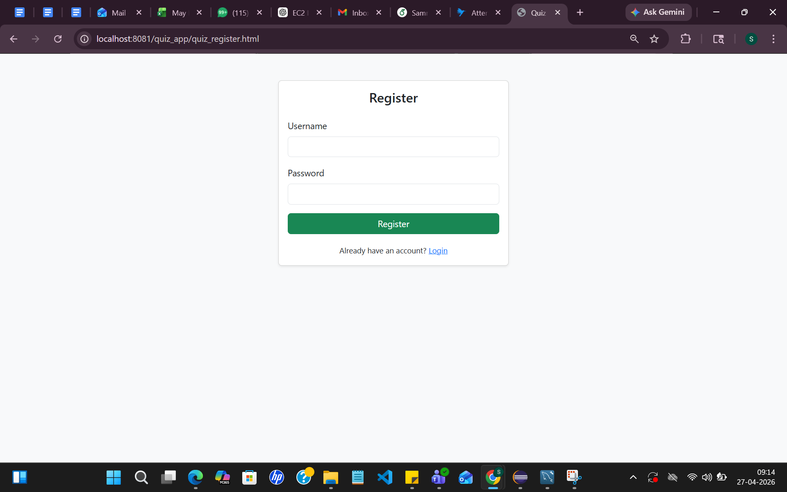
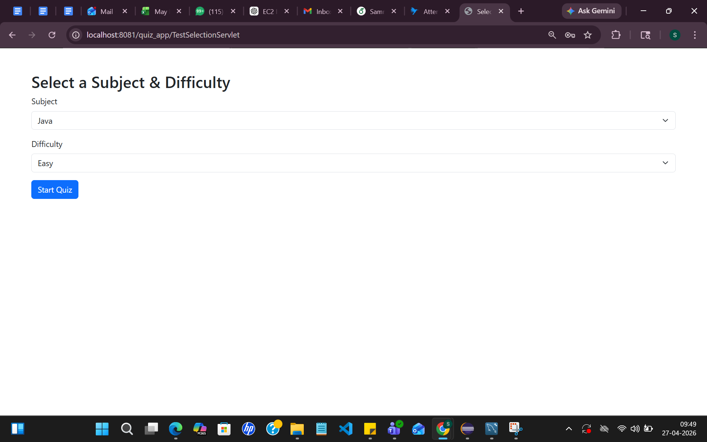
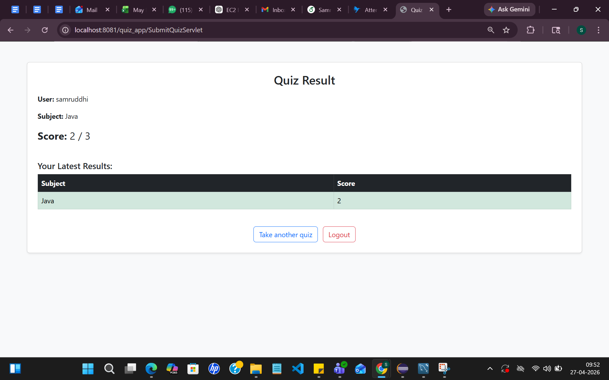

# Quiz Management System (Java Servlets + JDBC + MySQL)

## Overview

This project is a web-based Quiz Management System developed using Java Servlets, JDBC and MySQL following MVC layered architecture.

The system allows users to register, login, select quiz subjects, attempt quizzes and automatically calculates scores after submission. Quiz results are stored in the database.

---

## Tech Stack

Java (Core Java)

Java Servlets

JDBC

MySQL

HTML / CSS

Apache Tomcat v9

MVC Architecture

DAO Design Pattern

---

## Features

User Registration and Login

Subject-wise Quiz Selection

Dynamic Question Retrieval from Database

Automatic Score Calculation

Result Storage in Database

Session-based Authentication

Servlet-based Request Handling

DAO Pattern Implementation

---

## Project Architecture

Controller Layer → Servlets  
Service Layer → Business Logic  
DAO Layer → Database Interaction  
Model Layer → Entity Classes  
Database Layer → MySQL  
Frontend Layer → HTML Pages  

---

## Project Structure

quiz-system-java-servlet-jdbc

src/main/java/com/aurionpro
├── controller
│ ├── LoginServlet.java
│ ├── RegisterServlet.java
│ ├── QuizServlet.java
│ ├── SubmitQuizServlet.java
│ └── TestSelectionServlet.java
│
├── dao
│ ├── QuestionDao.java
│ ├── ResultDao.java
│ ├── SubjectDao.java
│ └── UserDao.java
│
├── database
│ └── Database.java
│
├── model
│ ├── Question.java
│ ├── Result.java
│ ├── Subject.java
│ └── User.java
│
└── service
└── UserService.java

src/main/webapp
├── META-INF
├── quiz_login.html
└── quiz_register.html

Screenshots
├── quiz_login.png
├── quiz_register.png
├── subject_selection.png
└── quiz_result.png

---

## Database Configuration

Database name:

quizdb

Tables used:

users
subjects
questions
results

Edit DB credentials inside:

src/main/java/com/aurionpro/database/Database.java

---

## How to Run

Clone repository

git clone https://github.com/Samruddhi2003github/quiz-system-java-servlet-jdbc.git

Start MySQL

Create database

quizdb

Update credentials in Database.java

Start Tomcat Server

Run:

http://localhost:8081/quiz_app/quiz_login.html

---

## Screenshots

### Login Page

### Register Page

### Subject Selection

### Quiz Result

---

## Author

Samruddhi Bansode  
AI & Data Science Engineer  
Java Backend Developer
